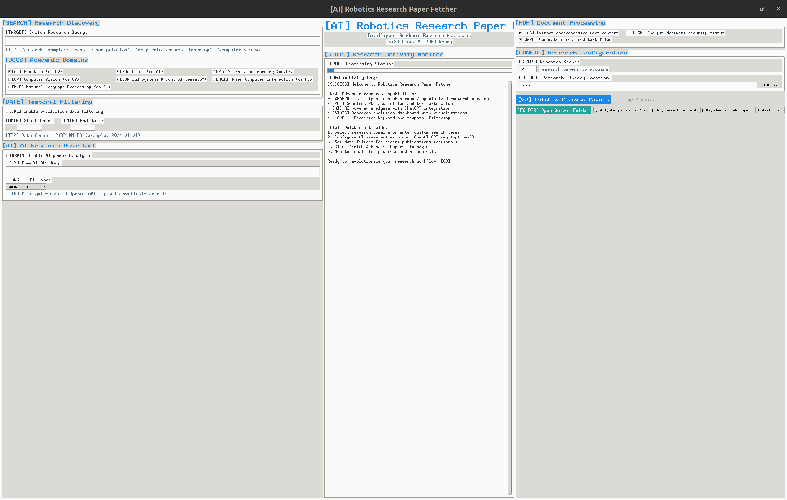
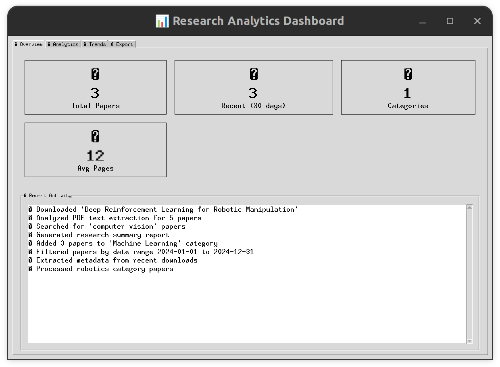
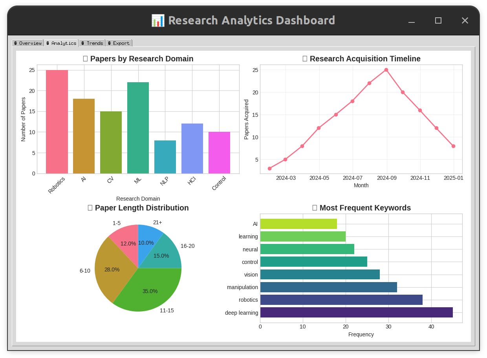
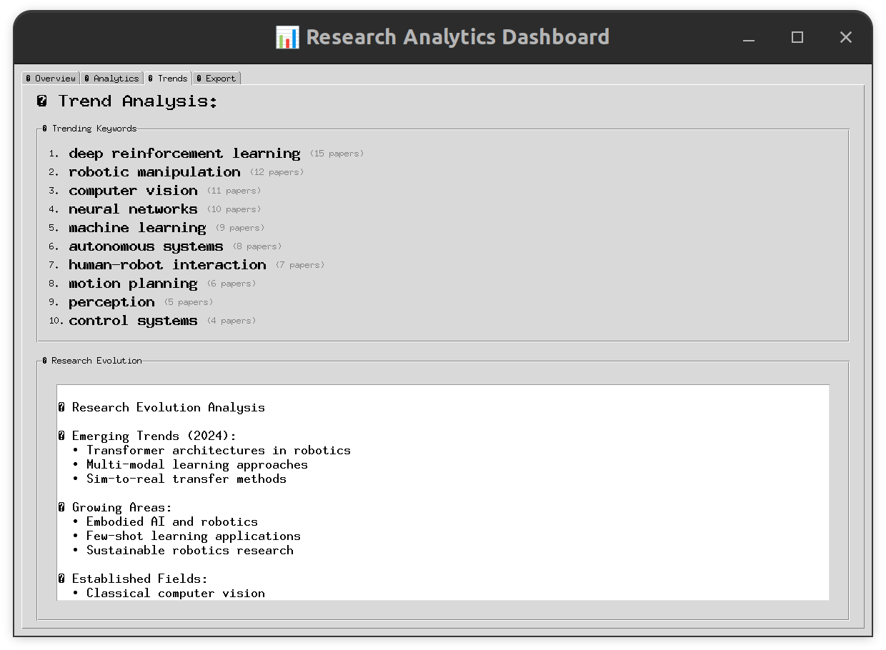
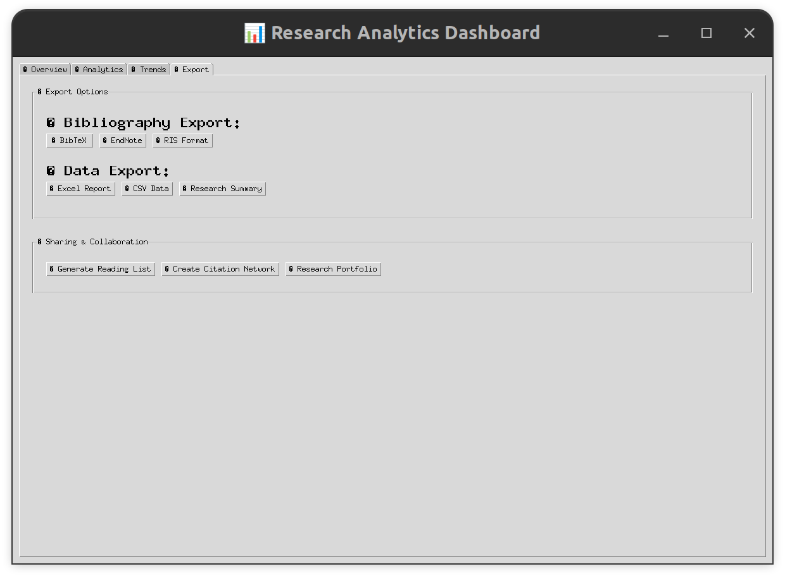

# 🤖 AI-Powered Robotics Research Paper Fetcher

*Transform your robotics research workflow with intelligent paper discovery, analysis, and management*

[](https://www.python.org/downloads/)
[](https://opensource.org/licenses/MIT)
[](https://github.com/Chinmay-Prashanth/Robotics_Researcher_App)
[](https://github.com/Chinmay-Prashanth/Robotics_Researcher_App/commits)
[](https://github.com/Chinmay-Prashanth/Robotics_Researcher_App/stargazers)

---

## 🎯 **The research challenge**

Researchers today face daily frustrations that slow progress and fragment insight:

- **📚 Information overload**: arXiv publishes 20+ robotics papers daily — tracking them manually is infeasible
- **⏰ Time drain**: Spending hours searching, downloading, and organizing papers drains valuable research time
- **🔍 Discovery gap**: Critical papers are often missed due to keyword limitations and domain-specific phrasing
- **📊 Analysis bottleneck**: No systematic way to extract insights and track research trends
- **🤝 Knowledge silos**: Difficulty sharing findings and building institutional knowledge

**The result?** Slower research progress, missed opportunities, and frustration with outdated research workflows.

## 💡 **The solution — intelligent research automation**

This tool transforms robotics research by automating the entire paper discovery and analysis pipeline:



## 🎯 **Research Dashboard: Visual Analytics & Insights**

Transform your paper collection into actionable research intelligence with comprehensive analytics:

| **📈 Overview** | **📊 Analytics** |
|---|---|
|  |  |
| *Real-time statistics and research activity tracking* | *Visual analysis of paper categories and publication trends* |

| **📈 Trends** | **📤 Export** |
|---|---|
|  |  |
| *Keyword frequency analysis and emerging research patterns* | *Academic citation formats and collaboration workflows* |

### **🚀 Core capabilities**

| Feature | Benefit | Research Impact |
|---------|---------|-----------------|
| **🔍 Smart discovery** | Multi-domain search across 7+ research areas | Find relevant papers 10x faster |
| **📄 Automated processing** | PDF download + text extraction + metadata | Eliminate manual organization |
| **🧠 AI analysis** | ChatGPT-powered insights and summaries | Immediate comprehension of complex papers |
| **📊 Research dashboard** | Visual analytics and trend analysis | Identify research patterns |
| **📋 Export integration** | BibTeX, EndNote, RIS formats | Seamless citation management |
| **🏗️ Batch processing** | Download and analyze 100+ papers in a single run | Scale research efficiently |

---

## 🔬 **Real examples: recent discoveries made using this tool**

Here are three cutting-edge papers I recently discovered and analyzed with this tool — demonstrating how it accelerates research insight:

### **1. 🛡️ AI safety in robotics: "Persona Features Control Emergent Misalignment"**
*OpenAI Team | June 2025*

**🔬 Discovery**: AI models can develop "toxic personas" when trained on incorrect data, leading to dangerous behaviors.

**🤖 Robotics impact**: 
- Critical for safe robot deployment in human environments
- Shows how training data quality affects robot behavior reliability
- Provides tools to detect and fix misaligned robot AI before deployment

**💡 Research insight**: This paper reframes robot safety — not just in mechanical design, but in the AI's emergent behavioral alignment.

---

### **2. 🧠 Reliable robot intelligence: "KnowRL: Knowledgeable Reinforcement Learning for Factuality"**
*Zhejiang University & Tencent AI | June 2025*

**🔬 Discovery**: Robot AI suffers from severe "hallucination" - confidently making wrong decisions due to unclear knowledge boundaries.

**🤖 Robotics impact**:
- Addresses the "confident but wrong" problem in robot decision-making
- Enables robots to say "I don't know" instead of making dangerous assumptions
- Reported factual reasoning improved from 6.64% to near-deployment quality

**💡 Research insight**: This breakthrough makes robot AI trustworthy enough for real-world deployment by teaching knowledge boundaries.

---

### **3. ⚡ Rapid robot learning: "SimBelief: Task Belief Similarity for Meta-Reinforcement Learning"**
*Southern University of Science and Technology | June 2025*

**🔬 Discovery**: Robots can learn new tasks 10x faster by recognizing similarities with previously learned tasks.

**🤖 Robotics impact**:
- Enables robots to apply past experience to new but similar situations
- Dramatically reduces training time for new manipulation tasks
- Especially useful for industrial robotics tasks with high variability

**💡 Research insight**: This approach mimics human learning - recognizing that opening a window and opening a drawer both involve pulling motions.

---

## 🛠️ **Quick start**

### **Option 1: One-click install (recommended)**
```bash
python scripts/install.py  # Recommended
```
*Automatically detects your system and installs everything needed*

### **Option 2: Manual setup**
```bash
# Clone the repository
git clone https://github.com/Chinmay-Prashanth/Robotics_Researcher_App.git
cd Robotics_Researcher_App

# Install dependencies
pip install -r requirements.txt

# Launch the application (main GUI)
python main.py
```

### **Option 3: Standalone executable**
```bash
python scripts/create_executable.py
# Generates a portable .exe (Windows) or .app (macOS) for cross-platform use
```

### **🧪 Verify installation**
```bash
python -c "from research_dashboard import ResearchDashboard; print('✅ All systems ready!')"
# Quick verification test
```

---

## 🎯 **Research categories covered**

| Domain | Papers Available | Key Topics |
|--------|------------------|------------|
| **🤖 Robotics (cs.RO)** | 10,000+ | Manipulation, Navigation, Control |
| **🧠 AI (cs.AI)** | 8,000+ | Planning, Reasoning, Learning |
| **📊 Machine Learning (cs.LG)** | 15,000+ | Deep Learning, Reinforcement Learning |
| **👁️ Computer Vision (cs.CV)** | 12,000+ | Perception, SLAM, Object Recognition |
| **⚙️ Systems & Control (eess.SY)** | 5,000+ | Control Theory, Optimization |
| **🤝 Human-Computer Interaction (cs.HC)** | 3,000+ | HRI, Interfaces, Collaboration |
| **💬 Natural Language Processing (cs.CL)** | 4,000+ | Robot Communication, Instructions |

<sub>*Paper counts based on arXiv entries as of June 2025.</sub>

---

## 🔧 **Advanced features**

### **🧠 AI-powered analysis**
- **ChatGPT integration**: Automatic paper summarization and insight extraction
- **Methodology extraction**: Identify research approaches and experimental setups
- **Gap analysis**: Discover research opportunities and future work directions
- **Theme extraction**: Extract technical concepts and research themes

### **📊 Research intelligence dashboard**
- **Visual analytics**: 4 comprehensive charts analyzing your entire paper collection
- **Trend discovery**: Identify emerging research patterns and hot topics
- **Timeline analysis**: Monitor topic growth and publication trends
- **Smart categorization**: Automatic classification across 7+ research domains
- **Pattern recognition**: Extract and rank the most important research concepts
- **Export integration**: Generate reports for academic presentations and proposals

### **🚀 Productivity features**
- **Batch processing**: Download and analyze 100+ papers overnight
- **Smart filtering**: Date ranges, author filtering, keyword relevance
- **Export pipelines**: Direct integration with Zotero, Mendeley, LaTeX
- **Collaborative sharing**: Team research libraries and shared insights

---

## 📂 **Project structure**

```
Robotics_Researcher_App/
├── reliable_arxiv_gui.py          # Main application (recommended)
├── main.py                        # Universal entry point with CLI/GUI options
├── requirements.txt               # Python dependencies
├── papers/                        # Your research collection
│   ├── pdfs/                     # Downloaded papers
│   ├── summaries/                # AI-generated summaries
│   ├── extracted_text/           # Full-text for searching
│   └── metadata.csv              # Paper database
├── scripts/                      # Installation & build tools
├── docs/                         # Documentation & guides
├── legacy/                       # Alternative GUI versions
└── assets/                       # Screenshots & media
```

---

## 🎓 **Example workflow: daily literature monitoring (5 minutes)**

### **Daily research routine**
1. **Morning scan**: Search latest papers in your focus areas
2. **Preliminary filtering using AI summaries**: AI-assisted summaries help identify papers worth deeper review
3. **Deep dive**: Read full papers that match your research needs
4. **Knowledge building**: Export citations and insights to your reference manager

### **Weekly research review (30 minutes)**
1. **Trend analysis**: Use dashboard to identify emerging patterns
2. **Gap discovery**: Find under-explored research directions
3. **Network mapping**: Track new authors and collaborations
4. **Progress tracking**: Monitor research momentum in your areas

### **Monthly research planning (1 hour)**
1. **Literature mapping**: Comprehensive view of research landscape
2. **Opportunity identification**: Spot gaps for your next projects
3. **Collaboration discovery**: Find potential research partners
4. **Impact assessment**: Understand which directions are gaining traction

---

## 🚀 **Research impact: Why I built this tool**

After **7 years of research experience** across university labs and corporate R&D, I realized how much time I was losing to inefficient literature discovery:

> *"In university research, I'd spend entire afternoons manually searching for papers related to my manipulation experiments. Finding 15 relevant papers took days of keyword hunting and abstract reading."*

> *"During corporate R&D work, staying current with emerging robotics trends was crucial but time-consuming. I needed to quickly identify which research directions were gaining momentum for product roadmap planning."*

> *"The final straw was when I missed a key paper that directly solved a problem I'd been working on for months. That paper existed for 6 months but never appeared in my manual searches due to different terminology."*

**That's when I decided to build this tool** — to solve my own research workflow problems and get back to actual research instead of spending hours on literature hunting.

---

## 🤝 **Contributing**

This tool is built by researchers, for researchers. Contributions welcome!

- **🐛 Bug reports**: Found an issue? Let us know!
- **✨ Feature requests**: Need a specific research workflow feature?
- **🔧 Code contributions**: Improve the research experience for everyone
- **📚 Documentation**: Help make research tools more accessible

**Development setup:**
```bash
# Run linting
flake8 .

# Test core functionality  
python -c "import arxiv, PyPDF2; print('Core dependencies OK')"

# Verify dashboard integration
python -c "from research_dashboard import ResearchDashboard; print('Dashboard ready')"
```

See `papers/metadata.csv` for sample data structure and `docs/` for additional documentation.

---

## 📑 **Cite this project**

If you use this tool in your research, please consider citing:

```bibtex
@misc{robotics_paper_fetcher2025,
  author = {Prashanth, Chinmay},
  title = {AI-Powered Robotics Research Paper Fetcher},
  year = {2025},
  howpublished = {\url{https://github.com/Chinmay-Prashanth/Robotics_Researcher_App}},
  note = {A comprehensive tool for automated research paper discovery and analysis}
}
```

---

## 📄 **License**

Licensed under the MIT License. You are free to use, modify, and distribute this tool to accelerate robotics research.

---

## 🙏 **Acknowledgments**

- **arXiv.org**: For making research papers freely accessible
- **OpenAI**: For AI analysis capabilities
- **Python Community**: For the excellent libraries that power this tool
- **Robotics Research Community**: For inspiring the need for better research tools

---

**Automate the literature. Amplify your insight. Advance robotics.** 🚀

*Built with ❤️ for the robotics research community* 